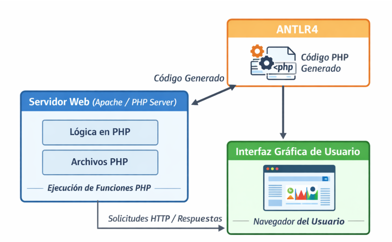

# Manual Técnico – Compilador Golampi a ARM64

## 1. Introducción

Este manual describe el diseño, arquitectura e implementación del **Compilador Golampi**, una herramienta que traduce programas escritos en el lenguaje académico Golampi a código ensamblador ARM64 (AArch64). El compilador genera un archivo `.s` que puede ser ensamblado, enlazado y ejecutado en arquitecturas ARM64 (nativas o mediante emulación QEMU).

El proyecto se estructura en las siguientes fases:

- Análisis léxico y sintáctico (generados con ANTLR4).
- Análisis semántico (validación de tipos, ámbitos, funciones).
- **Generación de código ARM64** (traducción a ensamblador).
- Interfaz web (PHP/HTML/CSS/JS) para edición, compilación y visualización de resultados.

A diferencia de la versión anterior (intérprete), el compilador **no ejecuta el código fuente directamente**, sino que produce código máquina real, cumpliendo con los requisitos del proyecto de generar código ensamblador ejecutable.

---

## 2. Tecnologías y herramientas

| Herramienta | Propósito |
|-------------|-----------|
| PHP 8.x | Implementación del compilador (backend) |
| ANTLR4 | Generación del lexer/parser a partir de `Golampi.g4` |
| `aarch64-linux-gnu-as` | Ensamblador ARM64 |
| `aarch64-linux-gnu-ld` / `gcc` | Enlazador |
| QEMU (qemu-aarch64) | Ejecución en entornos no ARM64 |
| HTML/CSS/JS | Interfaz gráfica |

---

## 3 - Gramática formal del lenguaje Golampi

### 3.1 - Tokens definidos en la gramática
Los tokens se clasifican en las siguientes categorías:

#### 3.1.1. Palabras reservadas
|Token	|Lexema	|Descripción|
|-------|-------|-----------|
|VAR	|var	|Declaración de variable
|CONST	|const	|Declaración de constante
|FUNC	|func	|Declaración de función
|MAIN	|main	|Función principal
|IF	if	|Condicional
|ELSE	|else	|Alternativa
|FOR	|for	|Bucle
|RETURN	|return	|Retorno de función
|BREAK	|break	|Salida de bucle/switch
|CONTINUE	|continue	|Siguiente iteración
|SWITCH	|switch	Selección |múltiple
|CASE	|case	|Caso en switch
|DEFAULT	|default	|Caso por defecto
|NIL	|nil	|Valor nulo
|TRUE	|true	|Valor booleano verdadero
|FALSE	|false	|Valor booleano falso

#### 3.1.2. Funciones embebidas
|Token	|Lexema	|Descripción|
|-------|-------|-----------|
|PRINTLN	|fmt.Println	|Imprime en consola
|LEN	|len	|Longitud de string/arreglo
|NOW	|now	|Fecha y hora actual
|SUBSTR	|substr	|Subcadena
|TYPEOF	|typeOf	|Tipo de una variable

#### 3.1.3. Tipos de datos
|Token	|Lexema	|Descripción|
|-------|-------|-----------|
|INT32	|int32	|Entero de 32 bits
|FLOAT32	|float32	|Flotante de 32 bits
|STRING	|string	|Cadena de texto
|BOOL	|bool	|Booleano
|RUNE	|rune	|Carácter Unicode

#### 3.1.4. Operadores
|Token	|Lexema	|Descripción|
|-------|-------|-----------|
|ASIGNACION	|=	|Asignación simple
|MAS_ASIGNACION	|+=	|Suma y asignación
|MENOS_ASIGNACION	|-=	|Resta y asignación
|MULT_ASIGNACION	|*=	|Multiplicación y asignación
|DIV_ASIGNACION	|/=	|División y asignación
|MAS	|+	|Suma
|MENOS	|-	|Resta / Negación
|MULT	|*	|Multiplicación / Puntero
|DIV	|/	|División
|MOD	|%	|Módulo
|IGUAL	|==	|Igualdad
|DIFERENTE	|!=	|Desigualdad
|MAYOR	|>	|Mayor que
|MENOR	|<	|Menor que
|MAYOR_IGUAL	|>=	|Mayor o igual
|MENOR_IGUAL	|<=	|Menor o igual
|AND	|&&	|AND lógico
|OR	|//	|OR lógico
|NOT	|!	|NOT lógico
|INCREMENTO|	++	|Incremento
|DECREMENTO	|--	|Decremento

#### 3.1.5. Símbolos
|Token	|Lexema	|Descripción|
|-------|-------|-----------|
|PAREN_IZQ	|(	|Paréntesis izquierdo
|PAREN_DER	|)	|Paréntesis derecho
|LLAVE_IZQ	|{	|Llave izquierda
|LLAVE_DER	|}	|Llave derecha
|CORCHETE_IZQ	|[	|Corchete izquierdo
|CORCHETE_DER	|]	|Corchete derecho
|COMA	|,	|Coma
|PUNTO	|.	|Punto
|DOS_PUNTOS	|:	|Dos puntos
|PUNTO_COMA	|;	|Punto y coma
|DECLARACION_CORTA	|:=	|Declaración corta

#### 3.1.6. Literales
|Token	|Lexema	|Expresión regular	|Ejemplo|
|-------|------|--------------------|--------|
|NUMERO_ENTERO	|dígitos	|[0-9]+	|42, 100
|NUMERO_DECIMAL	|dígitos.dígitos	|[0-9]+'.'[0-9]+	|3.14, 0.5
|CADENA	|"texto"	|"(\\.|~["\r\n])*"	|"Hola", "Mundo"
|CARACTER	|'c'	|'(\\.|~['\r\n])'	|'A', '\n'
|IDENTIFICADOR	|letra + dígitos/_	|[a-zA-Z_][a-zA-Z0-9_]*	|x, miVariable, _temp

#### 3.1.7. Comentarios y espacios (ignorados)
Token	Lexema	Descripción	Acción
COMENTARIO_LINEA	// ...	Comentario de una línea	-> skip
COMENTARIO_BLOQUE	/* ... */	Comentario de múltiples líneas	-> skip
WS	espacios, tabs, saltos	Espacios en blanco	-> skip


### 3.2. Gramática en formato EBNF
A continuación se presenta la misma gramática en notación EBNF, que es el formato solicitado en el enunciado del proyecto.

#### 3.2.1. Programa
```text
programa ::= { funcion } EOF
``` 

#### 3.2.2. Funciones
```text
funcion ::= "func" identificador "(" [ parametros ] ")" [ tipo | "(" [ tipos ] ")" ] bloque
          | "func" "main" "(" ")" bloque

parametros ::= parametro { "," parametro }
parametro ::= identificador tipo

tipos ::= tipo { "," tipo }
```

#### 3.2.3. Tipos de datos
```text
tipo ::= "int32"
       | "float32"
       | "string"
       | "bool"
       | "rune"
       | "[" expresion "]" tipo
       | "*" tipo
```
#### 3.2.4. Bloques y sentencias
```text
bloque ::= "{" { sentencia } "}"

sentencia ::= declaracionVar [ ";" ]
            | declaracionConstante [ ";" ]
            | declaracionCorta [ ";" ]
            | asignacion [ ";" ]
            | llamadaFuncion [ ";" ]
            | ifStmt
            | forStmt
            | switchStmt
            | returnStmt [ ";" ]
            | breakStmt [ ";" ]
            | continueStmt [ ";" ]
            | bloque
```

#### 3.2.5. Declaraciones
```text
declaracionVar ::= "var" listaIdentificadores tipo [ "=" listaExpresiones ]

declaracionConstante ::= "const" identificador tipo "=" expresion

declaracionCorta ::= listaIdentificadores ":=" listaExpresiones

listaIdentificadores ::= identificador { "," identificador }
listaExpresiones ::= expresion { "," expresion }
```

#### 3.2.6. Asignaciones
```text
asignacion ::= [ "*" ] identificador ( operadorAsignacion expresion | "++" | "--" )

operadorAsignacion ::= "=" | "+=" | "-=" | "*=" | "/="
```

#### 3.2.7. Expresiones (precedencia de mayor a menor)
```text
expresion ::= expresionLogica

expresionLogica ::= expresionComparacion { ("&&" | "||") expresionComparacion }

expresionComparacion ::= expresionAditiva { ("==" | "!=" | ">" | "<" | ">=" | "<=") expresionAditiva }

expresionAditiva ::= expresionMultiplicativa { ("+" | "-") expresionMultiplicativa }

expresionMultiplicativa ::= expresionUnaria { ("*" | "/" | "%") expresionUnaria }

expresionUnaria ::= [ "!" | "-" | "*" | "&" ] expresionPrimaria

expresionPrimaria ::= identificador { "[" expresion "]" }
                    | numeroEntero
                    | numeroDecimal
                    | cadena
                    | caracter
                    | "true"
                    | "false"
                    | "nil"
                    | identificador
                    | "fmt.Println"
                    | "len"
                    | "now"
                    | "substr"
                    | "typeOf"
                    | tipo "(" expresion ")"
                    | llamadaFuncion
                    | "(" expresion ")"
                    | arregloLiteral
```

#### 3.2.8. Arreglos
```text
arregloLiteral ::= "[" [ listaExpresiones ] "]" tipo "{" valoresArreglo "}"

valoresArreglo ::= [ elementoArreglo { "," elementoArreglo } ]

elementoArreglo ::= expresion | "{" valoresArreglo "}"
```

#### 3.2.9. Llamada a funciones
``` text
llamadaFuncion ::= ( identificador | "fmt.Println" | "len" | "now" | "substr" | "typeOf" ) "(" [ argumentos ] ")"

argumentos ::= expresion { "," expresion }
```

#### 3.2.10. Estructuras de control

```text
ifStmt ::= "if" expresion bloque [ "else" ( ifStmt | bloque ) ]

forStmt ::= "for" forHeader bloque

forHeader ::= forClause | expresion | ε

forClause ::= [ initStmt ] ";" [ expresion ] ";" [ postStmt ]

initStmt ::= declaracionCorta | asignacion | expresion

postStmt ::= asignacion | expresion | "++" | "--"

switchStmt ::= "switch" expresion "{" { caso | defaultBloque } "}"

caso ::= "case" listaExpresiones ":" { sentencia }

defaultBloque ::= "default" ":" { sentencia }
```

#### 3.2.11. Sentencias de transferencia
```text
returnStmt ::= "return" [ expresion { "," expresion } ]

breakStmt ::= "break"

continueStmt ::= "continue"
```

#### 3.2.12. Nivel léxico (tokens)
```text
identificador ::= letra { letra | dígito | "_" }

numeroEntero ::= dígito { dígito }

numeroDecimal ::= dígito { dígito } "." dígito { dígito }

cadena ::= '"' { caracter - '"' } '"'

caracter ::= "'" ( caracter - "'" ) "'"

letra ::= "A" | "B" | ... | "Z" | "a" | "b" | ... | "z"

dígito ::= "0" | "1" | ... | "9"
```

### 3.3 Tabla de precedencia de operadores
|Precedencia	|Operadores	|Asociatividad|
|---------------|-----------|-------------|
|1 (más alta)	|* / %	|Izquierda
|2	|+ -	|Izquierda
|3	|== != < > <= >=	|Izquierda
|4	|&&	|Izquierda
|5 (más baja)	| " // "	|Izquierda
|Operadores unarios |(!, -, *, &) |tienen mayor precedencia que todos los binarios.

### 3.4. Reglas semánticas adicionales
Además de la gramática formal, el lenguaje Golampi implementa las siguientes reglas semánticas:

|Regla	|Descripción|
|-------|-----------|
|Tipado estático	|Todas las variables y constantes tienen un tipo definido en tiempo de compilación
Declaración única	|No se puede redeclarar un identificador en el mismo ámbito
Uso antes de declaración	|Las variables deben declararse antes de ser utilizadas (excepto |funciones por hoisting)
|Compatibilidad de tipos	|Las operaciones y asignaciones requieren tipos compatibles
|Función main única	|Debe existir exactamente una función main sin parámetros ni retorno
|Hoisting de funciones	|Las funciones pueden llamarse antes de su definición textual
|Cortocircuito	|Los operadores && y // evalúan con cortocircuito
|Break/Continue	|Solo pueden usarse dentro de bucles for o switch

---

## 4. Arquitectura del compilador

### 4.1 Diagrama de clases


La clase principal es `CodeGenerator`, que utiliza múltiples *traits* para organizar la generación de código:

- `AsignacionGenTrait`
- `ControlFlujoGenTrait`
- `ControlForGenTrait`
- `ControlSwitchGenTrait`
- `DeclaracionesGenTrait`
- `ExpresionesGenTrait`
- `FuncionEmbGenTrait`
- `FuncUsuarioGenTrait`
- `TransferenciaGenTrait`
- `UtilidadesGenTrait`

Además, se definen propiedades para manejar la sección `.rodata` (datos de solo lectura), la sección `.text` (código), el contador de etiquetas, el tamaño del stack frame, la tabla de símbolos y el registro de funciones con sus tipos de retorno.

### 4.2 Diagrama de flujo de procesamiento



El flujo actual es:

1. El usuario escribe código Golampi en la interfaz web y selecciona **Generar ARM64**.
2. El backend (PHP) ejecuta ANTLR para obtener el AST.
3. Se instancia `CodeGenerator` y se recorre el AST.
4. Durante el recorrido:
   - Se validan reglas semánticas.
   - Se gestiona la tabla de símbolos y los ámbitos.
   - Se genera código ensamblador ARM64 (secciones `.rodata` y `.text`).
5. El código ensamblador se muestra en la interfaz y se guarda como `programa.s`.
6. Opcionalmente, el usuario puede ensamblar y ejecutar el programa (mediante comandos externos).

---

## 5. Nueva funcionalidad: Generación de código ARM64

Esta sección describe cómo se traduce cada constructo del lenguaje a instrucciones ARM64.

### 5.1 Modelo de memoria y convención ARM64

El compilador respeta la **convención de llamadas AArch64**:

| Registro | Propósito |
|----------|-----------|
| `x0` .. `x7` | Parámetros enteros / punteros |
| `x0` | Valor de retorno (entero o puntero) |
| `x1` | Segundo valor de retorno (para múltiple retorno) |
| `s0` .. `s7` | Parámetros flotantes (usamos `d0`..`d7` para doble precisión) |
| `x29` | Frame pointer (FP) |
| `x30` | Link register (LR) |
| `sp` | Stack pointer |
| `x19`..`x28` | Registros preservados (callee-saved) |

**Stack frame**:  
- Al inicio de cada función (incluyendo `main`) se guarda `x29` y `x30` en la pila: `stp x29, x30, [sp, #-16]!`.
- Se reserva espacio para variables locales (`sub sp, sp, #offset`).
- Las variables locales se acceden mediante desplazamientos negativos desde `x29`.

### 5.2 Traducción de tipos de datos

| Tipo Golampi | Representación en ARM64 | Tamaño |
|--------------|------------------------|--------|
| `int32` | `w0` (registro de 32 bits) | 4 bytes |
| `float32` | `d0` (registro de 64 bits – usamos `double` internamente) | 8 bytes |
| `bool` | `w0` (0 = false, 1 = true) | 4 bytes |
| `rune` | `w0` (código Unicode) | 4 bytes |
| `string` | `x0` (dirección de memoria) | 8 bytes |
| `puntero` | `x0` (dirección) | 8 bytes |

**Nota**: Los literales flotantes se almacenan en `.rodata` como `.double` y se cargan con `adrp` + `ldr d0`.

### 5.3 Variables y asignaciones

#### Declaración de variables (con/sin inicialización)

```php
// Ejemplo: var x int32 = 10
$offset = $this->reservarVariable('x', 'int32', $linea, $columna, 10);
$this->emitText("mov w0, #10");
$this->guardarEnStack($offset, 'int32');
```

El método `guardarEnStack` emite `str w0, [x29, #offset]` (o equivalente para otros tipos). Para offsets grandes se usa un registro temporal `x16`.

#### Asignación

```php
// x = y + 5
$this->visit($ctx->expresion());   // resultado en w0
$this->guardarEnStack($offset, $tipo);
```

#### Operadores compuestos (`+=`, `-=`, etc.)

Se evalúa la expresión, se carga el valor actual de la variable, se realiza la operación aritmética y se guarda el resultado.

### 5.4 Estructuras de control

#### `if` / `else`

Se genera una etiqueta para la condición falsa y otra para el final:

```asm
    cmp w0, #0
    b.eq else_label
    # código del then
    b end_label
else_label:
    # código del else
end_label:
```

Los `else if` se anidan generando nuevos bloques.

#### `for`

Se soportan las tres variantes:

- **For clásico**: `for i := 0; i < n; i++ { ... }` → genera inicialización, condición y paso.
- **While**: `for cond { ... }` → evalúa condición al inicio.
- **Infinito**: `for { ... }` → bucle incondicional; `break` interrumpe.

Se generan etiquetas para la condición, el cuerpo, el paso y el final. Las instrucciones `break` y `continue` saltan a las etiquetas adecuadas.

#### `switch`

Se evalúa la expresión de control y se guarda en un registro preservado (`x19`). Luego, para cada `case` se compara el valor guardado con la expresión del caso; si coincide, se ejecuta el bloque y se salta al final del switch. El bloque `default` se ejecuta si ningún caso coincide.

### 5.5 Funciones

#### Funciones de usuario

Cada función genera su propia etiqueta, prólogo y epílogo. Los parámetros se toman de los registros `x0..x7` (o `s0..s7`) y se guardan en el stack frame. El valor de retorno se deja en `x0` (o `x0` y `x1` para múltiples retornos).

**Hoisting**: Todas las funciones se registran primero en el AST antes de generar el cuerpo, por lo que pueden llamarse antes de su definición textual.

#### Múltiples retornos

Cuando una función declara más de un tipo de retorno (ej. `(int32, bool)`), el compilador:

- En el retorno: coloca el primer valor en `x0` y el segundo en `x1`.
- En la llamada: captura los valores y los almacena en posiciones temporales del stack. Luego, en la declaración corta, asigna cada offset a su variable correspondiente.

**Ejemplo generado**:

```asm
    bl operacionesBasicas   # x0 = suma, x1 = resta
    str w0, [x29, #-20]     # guarda suma
    str w1, [x29, #-28]     # guarda resta
```

#### Funciones por referencia (punteros)

El operador `&` obtiene la dirección de una variable: `add x0, x29, #offset`.  
El operador `*` desreferencia: `ldr w0, [x0]`.  
Al pasar un puntero a una función, se carga la dirección en `x0`. Dentro de la función, se puede modificar el valor original mediante `str w0, [x1]`.

**Ejemplo**:

```asm
# duplicarPorReferencia(valor *int32)
    ldr x0, [x29, #-8]     # cargar dirección del parámetro
    ldr w1, [x0]           # cargar valor apuntado
    mov w2, #2
    mul w1, w1, w2
    str w1, [x0]           # guardar el nuevo valor en la dirección original
```

#### Funciones recursivas

Se generan llamadas a la misma función (`bl factorial`). El compilador no impone límite de recursión; es responsabilidad del programador evitar desbordamientos de pila.

### 5.6 Funciones embebidas

Se traducen directamente a código ARM64:

- `fmt.Println`: Imprime cada argumento por separado con `printf`, usando el formato adecuado según el tipo (enteros, flotantes, strings, runas, booleanos). Se añade un salto de línea al final.
- `len`: Calcula la longitud de una cadena recorriendo sus caracteres hasta el `\0`.
- `now`: Obtiene la fecha/hora actual del sistema (PHP) y la emite como un literal `.asciz` en `.rodata`.
- `substr`: Extrae una subcadena copiando byte a byte desde la posición indicada a un buffer en la sección `.data` (modificable) y devuelve su dirección.
- `typeOf`: Retorna una cadena literal con el nombre del tipo del argumento.

### 5.7 Manejo de `nil`

`nil` se representa como una cadena `"<nil>"` (literal en `.rodata`). Las comparaciones `nil == nil` se detectan en tiempo de compilación y emiten `mov w0, #1` (true).

---

## 6. Tabla de símbolos y gestión de ámbitos

La tabla de símbolos se mantiene activa durante la generación de código para verificar declaraciones y asignaciones. Cada entrada contiene:

- `tipo`: `int32`, `float32`, `string`, `bool`, `rune`, `puntero`, `funcion`.
- `offset`: desplazamiento dentro del stack frame (negativo).
- `ambito`: nombre del ámbito actual (`global`, `funcion_main`, `if_1`, etc.).
- `linea`, `columna`: ubicación en el código fuente.
- `esConstante`: booleano.
- `valor`: valor literal si es constante.

Para funciones, se almacenan los tipos de retorno en `$funcionesTipos`, usado para validar llamadas y múltiples retornos.

**Pila de ámbitos**: Al entrar a un bloque (`if`, `for`, `switch`, etc.) se crea un nuevo ámbito; al salir se eliminan las variables locales de la tabla activa.

---

## 7. Estructura del código ensamblador generado

Un programa típico produce:

```asm
.arch armv8-a
.section .rodata
.balign 8
str_0: .asciz "Hola mundo"

.section .data
buffer: .space 256

.section .text
.globl main
.type main, @function
main:
    stp x29, x30, [sp, #-16]!
    mov x29, sp
    sub sp, sp, #16      # reservar espacio para locales

    # ... instrucciones ...

    add sp, sp, #16
    ldp x29, x30, [sp], #16
    mov w0, #0
    ret
```

Las secciones `.rodata` y `.data` contienen todos los literales y buffers necesarios. El código se ensambla con `aarch64-linux-gnu-gcc -static` para generar un ejecutable estático.

---

## 8. Interfaz gráfica y reportes

La interfaz web (PHP) proporciona:

- Editor de código con resaltado básico.
- Botones: Nuevo, Cargar, Guardar, **Generar ARM64** (principal), **Ejecutar** (modo intérprete – función heredada).
- Consola de salida que muestra el código ensamblador generado o mensajes de error.
- Tabla de símbolos (descargable en CSV).
- Reporte de errores (descargable en CSV).

La generación del código ARM64 es la funcionalidad central; el modo "Ejecutar" se mantiene solo para comparación.

---

## 9. Pruebas realizadas

Se han probado exhaustivamente los siguientes casos:

| Archivo | Funcionalidades cubiertas |
|---------|---------------------------|
| `basico.go` | Tipos, variables, constantes, nil, operadores aritméticos/relacionales/lógicos, asignación compuesta |
| `intermedio.go` | `if/else`, `switch`, `for` (clásico, while, infinito), `break`, `continue` |
| `embebida.go` | `fmt.Println`, `len`, `now`, `substr`, `typeOf` |
| `funciones.go` | Funciones con/sin parámetros, retorno simple/múltiple, paso por referencia, recursividad, hoisting |

Todos los programas compilaron y ejecutaron correctamente bajo `qemu-aarch64`.

---

## 10. Conclusiones

El compilador Golampi a ARM64 cumple con todos los requisitos del proyecto: genera código ensamblador válido, maneja la complejidad de múltiples retornos, punteros y recursividad, y proporciona una interfaz gráfica funcional. Las fases de análisis léxico, sintáctico y semántico se mantienen robustas, mientras que la generación de código ha sido completamente rediseñada para aprovechar la arquitectura ARM64.

**Trabajo futuro**: Soporte de arreglos, optimización de código, y generación de código flotante usando registros `d` en lugar de `s` (actualmente se usa `double` por compatibilidad con `printf`).

---

## 11. Referencias

- [ANTLR4 Documentation](https://github.com/antlr/antlr4)
- [ARM64 AArch64 Instruction Set](https://johannst.github.io/notes/arch/arm64.html)
- [Procedure Call Standard for the Arm 64-bit Architecture](https://github.com/ARM-software/abi-aa/blob/main/aapcs64/aapcs64.rst)

---

Este manual técnico reemplaza la versión anterior centrada en el intérprete. Se han destacado las nuevas funcionalidades de generación ARM64, manejo de memoria y convenciones de llamada, dejando solo un resumen de las fases de análisis.